# Rock, Scissors, Paper, Lizard, Spock

Visit the deployed site: [Rock, Scissors, Paper, Lizard, Spock](https://fariba-kamani.github.io/rockScissorsPaperLizardSpock/)

Rock, Scissors, Paper, Lizard, Spock is an expansion of Rock, Paper, Scissors with the additional hand signs of Lizard and Spock. It was first invented by Sam Kass, an internet pioneer and blogger. It has also been featured in an episode of the TV show, The Big Bang Theory [1](https://bigbangtheory.fandom.com/wiki/Rock,_Paper,_Scissors,_Lizard,_Spock), [2](https://bigbangtheory.fandom.com/wiki/Sam_Kass).

This website is a game application based on the mentioned expansion, in which the player competes against the computer in seven rounds before the game decides the winner. Emojis have been used to showcase the hand signs in the game and are called weapons. ‘✊’ (raised fist) for rock, ‘✋’ (raised hand) for paper, ‘✌️’ (peace) for scissors, ‘🦎’ for lizard, and ‘🖖’ (Vulcan salute) for Spock are available for the player to choose from in the form of five buttons during each round. At first, the hand sign ‘🤌’ (pinched fingers) was used for lizard, but during the game development, I decided that ‘🦎’ for lizard is more intuitive and recognizable. Additionally, it brings another layer of playfulness to the game design.

The game starts with a login form where the player is asked to enter a name, which will then be used to display the player’s score in the game, giving a more personal feeling. In each round, the player chooses one of the weapons mentioned above, while the computer makes a random selection of the weapons. Both the player’s and the computer’s choices will be displayed right underneath the header on top of the page body. The winner’s score increases for each round. In tie situations, both the player and the computer get one point each. The round’s result will be displayed in green if the player wins, in red if the computer wins, and in black if it’s a tie.

The rules are: Scissors cut paper, paper covers rock, rock crushes lizard, lizard poisons Spock, Spock smashes scissors, scissors decapitate lizard, lizard eats paper, paper disproves Spock, Spock vaporizes rock, and as it always has, rock crushes scissors. The rules are accessible at all times during the game on the top right side of the header, indicated by a question mark icon.

The final result will be shown after all seven rounds are completed, giving the player two options: either playing again or quitting the game. The options are represented as buttons using emojis, continuing the theme of using hand gestures: 👍 (thumbs up) for yes and playing a new game, and 👎 (thumbs down) for no and quitting the game. If the player chooses yes, a new game with reset scores and rounds will begin, and if they choose no, they will be directed to the login.

The purpose of creating this game is to entertain users by providing a fun and casual experience while demonstrating core concepts in front-end web development, including HTML, CSS, and JavaScript. It features a simple, user-friendly interface that ensures smooth gameplay and instant visual feedback on the user’s and computer’s choices, as well as the game results. I have ensured the use of responsive layouts so that the game works well on all screen sizes. Additionally, features like keyboard controls and screen reader support have been added to make the game accessible to a wider audience.

## CONTENTS

* [User Experience](#user-experience-ux)
  * [User Stories](#user-stories)

* [Design](#design)
  * [Colour Scheme](#colour-scheme)
  * [Typography](#typography)
  * [Imagery](#imagery)
  * [Wireframes](#wireframes)
  * [Features](#features)
    * [Login](#login)
    * [Game](#game)
    * [Rules](#rules)
    * [Final result](#final-result)
  * [Accessibility](#accessibility)

* [Technologies Used](#technologies-used)
  * [Languages Used](#languages-used)
  * [Frameworks, Libraries & Programs Used](#frameworks-libraries--programs-used)

* [Deployment & Local Development](#deployment--local-development)
  * [Deployment](#deployment)
  * [Local Development](#local-development)
    * [How to Fork](#how-to-fork)
    * [How to Clone](#how-to-clone)

* [Testing](#testing)
  * [Solved Bugs](#solved-bugs)
  * [Known Bugs](#known-bugs)
  
* [Credits](#credits)
  * [Code Used](#code-used)
  * [Content](#content)
  * [Acknowledgments](#acknowledgments)

- - -

## User Experience (UX)

### User Stories

#### First Time Visitor Goals
* As a first-time visitor, I want to understand the rules and mechanics of the game quickly, so that I can start playing without confusion.
* As a first-time visitor, I want an intitive and engaging interface that immediately explains what to do, so I can begin playing right away.
* As a first-time visitor, I want to have access to the rules and tutorials at any time, so I can confidently make my choices during the game.
* As a first-time visitor, I want the interface to be responsive and compatible with my device.

#### Returning Visitor Goals

* As a returning visitor, I want to start playing right away without having to go through the tutorial or introduction.
* As a returning visitor, I want an easy login with minimal input required to start the game.

#### Frequent Visitor Goals

* As a frequent visitor, I want to be able to choose between other players or the computer to compete with.

- - -

## Design

### Colour Scheme

As I chose to use emojis to design the game mechanics and to check if the user wants to play again in the final stage, I decided to use the yellow shade of the hand sign emojis and the green shade of the lizard emoji for the game’s color scheme. Below is an overview of the primary, secondary, and accent colors used:

For the primary background colors, I applied #e2f5e2 to the header and footer backgrounds and white to the body background. This helps users understand where the header and footer end and the main section begins, while also maintaining a consistent brand identity across the website.

For the primary text color, I applied rgb(3, 3, 14), a rich black color that contrasts well against both primary background colors mentioned above, enhancing accessibility for users.

The secondary text colors I have used are red and #00d26a. Red is used to display the computer’s score, results when the computer wins in the game setting, and validation error messages during the login phase. #00d26a is used to display the user’s score, results when the user wins, and the rules title when the rules section opens.

#00d26a, #ffc83d, and #d67d00 have been applied as accent colors to buttons, borders, focus, and hover effects to make the intended objects stand out from the background and make the interface more interactive and engaging for the user.

Finally, rgb(79, 79, 91) has been used to add shadow and dimension to the game control buttons, as well as the yes and no buttons for handling the exit game scenario, enhancing the visibility of these elements.

### Typography

For this project, I decided to host the Google Fonts locally to eliminate the need for an external network request and improve the performance score of my website. To do so, I downloaded the fonts I had previously chosen from [Google Fonts](https://fonts.google.com/) using [google-webfonts-helper](https://gwfh.mranftl.com/fonts) and placed them in the assets/fonts directory of my project. I then updated the CSS to reference the locally stored fonts.

* For the body, I have used the font Cabin. This font is a modern take on early 20th-century modernist sans-serif fonts; it is simple and readable but includes more modern curves and a unique style. Cabin has been featured in many game apps due to its legibility, approachable aesthetic, and web and mobile friendliness, which also influenced my decision to use it for my project. [3](https://fonts.google.com/specimen/Cabin/about), [4](https://github.com/impallari/Cabin)

* For the title, I used the Cabin Sketch font, a hand-drawn and playful variant of the Cabin font, which I think it gives the website a casual and artsy vibe.

* In case the imported Google fonts don’t load, both fonts will fall back to sans-serif.

### Imagery

The only image used on the website is the logo, located on the left-hand side of the header. To optimize the image for the website and improve loading times for users, I used [Image Resizer.com](https://imageresizer.com/) to resize and compress the logo, and [freeconvert.com](https://www.freeconvert.com/jpg-to-webp) to convert it to WebP format. The image was downloaded from https://www.pikpng.com/downpngs/Jhxmoi_pierre-ciseaux-feuille-lzard-spock-aligned-rock-paper/. I have added an alt attribute to the image to display text if the image file doesn’t load and to describe the image for screen readers used by visually impaired users.

### Wireframes

Wireframes were created for mobile, tablet and desktop using balsamiq.

| Screen size | Login | Game | Rules | Final result |
| :--- | :--- | :--- | :--- | :--- |
| mobile |  | 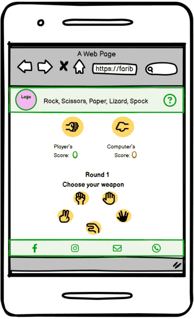 | 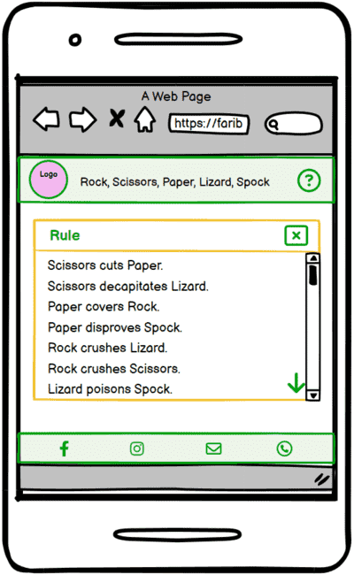 | 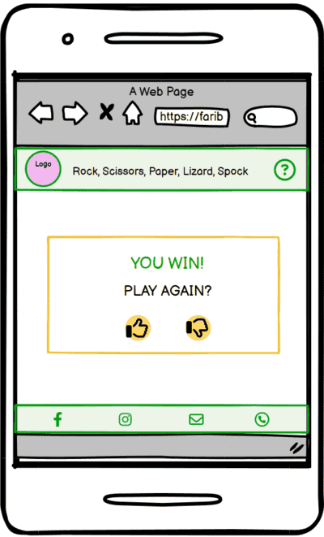 |
| tablet |  |  | 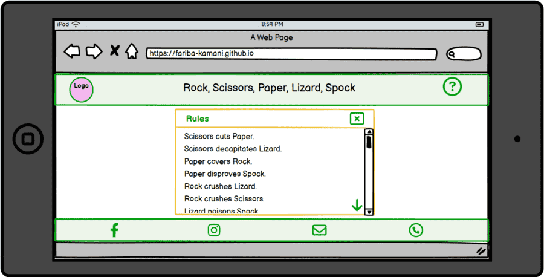 |  |
| desktop | 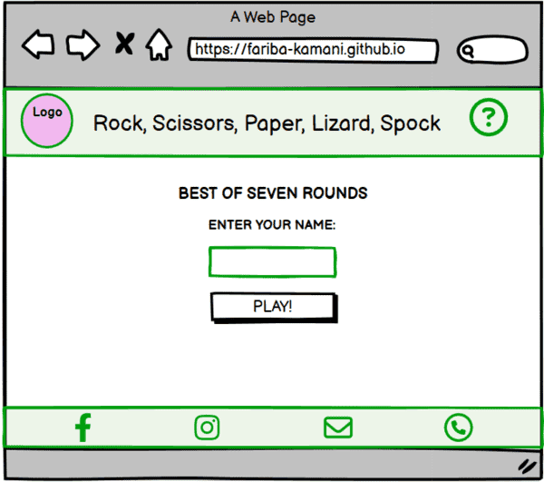 | 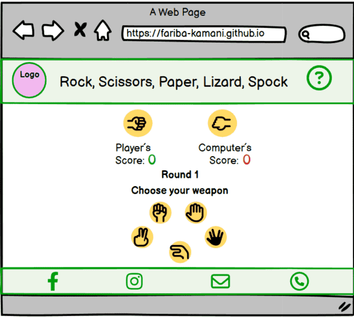 | 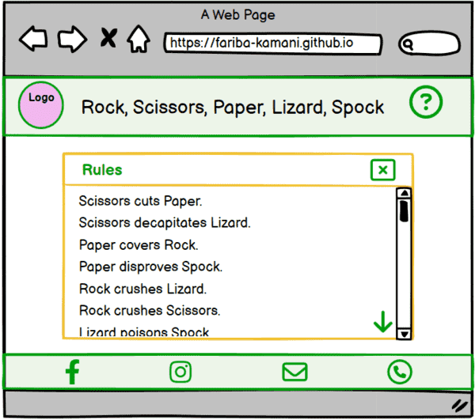 | 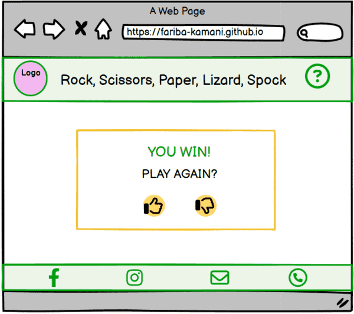 |

### Features

The website consists of a home page and a 404 error page. 
The home page consists of three phases; the login phase, the game phase and the final result phase. The rules are available at all time during all phases of the home page with an exception of during result display of each round.
the 404 error page to make sure that Github shows the 404.html when the page is not found. The 500 error page hasn't been added since GitHub Pages does not handle 500 errors since it's a static site hosting service.
Both html pages on the website are responsive on all devices and have the following common features: 

* The favicon in the browser tab.

  

* The header

  

  * The logo on the left hand side of the header.

    

  * The title of the site in the center of the header. 

    

  * The rules button, shown with a question mark icon on the right-hand side of the header and Added hover effect for desktop screens, does not appear on the 404 error page. Instead, a yellow exclamation mark is displayed.

      

* The rules box; opens with the rules button

  

    * The rules box header, sticks to the top during scrolling

    * The rules box title on the left hand-side

    * The close icon on the right hand-side, works as a closing button, can be selected and closed with both mouse and tab key, added hover effect for desktop screens

      

      

    * The vertical scroll bar

      

    * The sticky scroll down arrow to the bottom right of the rules box, works as a link to bottom of the rules list

      

* The footer of the site, located at the bottom of every page, features icon links to the website’s Facebook, Instagram, email, and phone. These links are displayed using Font Awesome icons. Added hover effect for desktop screens.

  

  

#### The Login Phase

* The section title

* The login form

  * The name input field and it's label. Allowed auto complete, and added focus function on page load

  

  * The PLAY! button that submits the form. Added hover effect for desktop screens.

   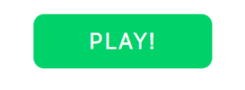

  * The form validation error message; appears in red text underneath the name input for three seconds after each attempt to submit and invalid input.

  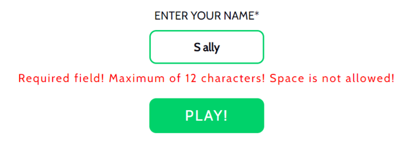

#### The Game Phase

  * The result display area

     

    * The players' pick display

      

    * The score area

      

    * The round result display

      * The user wins message
        
        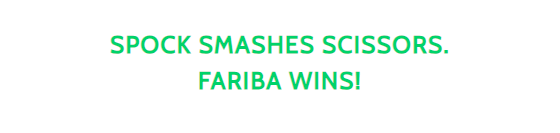

      * The computer wins message

        

      * The it's a tie message

        

      * Wait to see the final result

        

  * The controls area

    

    * The section title and the round counter

      

    * The control buttons, added hover effect for desktop screens

       

       

#### The Final result Phase

  * The final result display

    

    
  
  * The YES/NO buttons, added hover effect for desktop screens

    

    

    * The thumb up button; takes the user back to a new game.
  
    * The thumb down button; reloads the page and takes the user back to the login phase.

#### The 404 error page

 * The 404 error page message
  
  

* The back to home page link

  

#### Future Implementations

In future implementations I would like to:

1. 
2. 
3. 

### Accessibility

I have been mindful during coding to ensure that anyone can understand my website, regardless of auditory, visual, or physical disability.

* Semantic HTML has been used to help both the browser understand the content and provide screen readers with extra functionality for keyboard operation, rather than relying solely on a mouse.
* Semantic text structure, such as headings, paragraphs, and lists, has been used to help screen readers provide the indicators they need to read out the content in a useful way.
* Semantic structural elements, such as nav, header, section, and footer, have been used to provide screen readers with important information that can be conveyed to their users.
* UI controls, such as links, buttons, and forms, have been used to allow users to interact with the website. By browser default, they can be accessed using a keyboard or by clicking the tab key to jump from one UI control to another.
* Form labels have been used so that screen readers can clearly label input fields for users.
* The aria-label attribute has been used to provide a more meaningful description for icons, links, background images, and interactive elements, specifically for screen reader users.
* Use a hover state on all buttons on the site to make it clear to the user whether they are hovering over a button.
* Use a sensible font, font sizes, line heights, color contrast for the text content and sticking to common conventions to make the website intuitive, easy to read and follow for all users.

- - -

## Technologies Used

### Languages Used

HTML, CSS, and JavaScript

### Frameworks, Libraries & Programs Used

* [Balsamiq](https://balsamiq.com/) - Used to create wireframes.

* [Git](https://git-scm.com/) - For version control.

* [Github](https://github.com/) - To save and store the files for the website.

* [GitPod](https://gitpod.io/) - IDE used to create the site.

* [Google Fonts](https://fonts.google.com/) - To import the fonts used on the website.

* [Chrome DevTools](https://developer.chrome.com/docs/devtools) - To troubleshoot and test features, solve issues with responsiveness and styling.

* [Favicon generator](https://realfavicongenerator.net/) To create favicon.

* [Am I Responsive?](http://ami.responsivedesign.is/) To show the website image on a range of devices.

* [Tinify](https://tinypng.com/) To compress images.

* [Image Resizer.com](https://imageresizer.com/) To resize and compress images. 

* [FreeConver](https://www.freeconvert.com/jpg-to-webp) To convert the images to webp format.
 
* [Microsoft Bing Copilot Tools](https://www.bing.com/chat) - An AI chat that I used to check the spell and grammar of my website and README.md file.
- - -

## Deployment & Local Development

### Deployment

The site is deployed using GitHub Pages - [Let's Padel](https://fariba-kamani.github.io/lets-padel/).

To Deploy the site using GitHub Pages:

1. Login (or signup) to Github.
2. Go to the repository for this project, [fariba-kamani/lets-padel](https://github.com/fariba-kamani/lets-padel).
3. Click the settings button.
4. Select pages in the left hand navigation menu.
5. From the source dropdown select main branch and press save.
6. The site has now been deployed, please note that this process may take a few minutes before the site goes live.

### Local Development

#### How to Fork

To fork the repository:

1. Log in (or sign up) to Github.
2. Go to the repository for this project, [fariba-kamani/lets-padel](https://github.com/fariba-kamani/lets-padel)
3. Click the Fork button in the top right corner.

#### How to Clone

To clone the repository:

1. Log in (or sign up) to GitHub.
2. Go to the repository for this project, [fariba-kamani/lets-padel](https://github.com/fariba-kamani/lets-padel)
3. Click on the code button, select whether you would like to clone with HTTPS, SSH or GitHub CLI and copy the link shown.
4. Open the terminal in your code editor and change the current working directory to the location you want to use for the cloned directory.
5. Type 'git clone' into the terminal and then paste the link you copied in step 3. Press enter.

- - -

## Testing

Please refer to [TESTING.md](TESTING.md) file for all testing carried out.

### Solved Bugs

### Known Bugs

- - -

## Credits

### Code Used

Throughout the entire project development, I utilized the Code Institute course material for HTML and CSS. I followed the tutorials for the Love Running walkthrough project to set up and start my project properly, make a dropdown navigation menu using checkbox for mobile screens, and make a masonry design for how the images display on the Gallery page depending on the screen size. Additionally, I incorporated ideas from the Coders Coffeehouse walkthrough project to make the content in the second section of the Home page responsive using inline-block display property.

I have used [Stack Overflow](stackoverflow.com) to get some ideas for how to use regular expression in order to define patterns for the form input validation of input type="text" and input type="tel".

I have also used the tutor support to learn how to link to an email and phone number in the footer. This allows users to open their email client with a specified recipient or trigger a phone call (on mobiles) by clicking the phone icon link in the footer.

### Content

For documentation and creating my README.md file I have taken inspiration from the sample README.md file that my mentor shared with me [The Quiz Arms](https://github.com/kera-cudmore/TheQuizArms/blob/main/README.md) as well as the README.md sample available on the course for Portfolio 1: Assessments Guide Preview.

All the imagery I’ve used, along with the corresponding links, is provided in [Imagery](#imagery) section.

### Acknowledgments

I would like to acknowledge

* My Code Institute mentor, Jubril Akolade, for reviewing my project and inspiring me to improve my website.
* The Code Institute tutor team, who were available and guided me whenever I was stuck troubleshooting issues during the development of my project.
* My partner and friends, who took the time to test my website on their devices and provided constructive feedback.