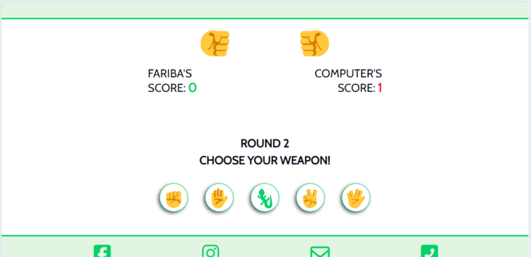

# Rock, Scissors, Paper, Lizard, Spock -  Testing

Visit the deployed site: [Rock, Scissors, Paper, Lizard, Spock](https://fariba-kamani.github.io/rockScissorsPaperLizardSpock/)

- - -

## CONTENTS

* [AUTOMATED TESTING](#automated-testing)
  * [W3C Validator](#w3c-validator)
  * [JavaScript Validator](#javascript-validator)
  * [Lighthouse](#lighthouse)
    * [Desktop Results](#desktop-results)
    * [Mobile Results](#mobile-results)
  * [Accessibility Testing](#accessibility-testing)
  * [Responsive Testing](#responsive-testing)
* [MANUAL TESTING](#manual-testing)
  * [Testing User Stories](#testing-user-stories)
  * [The Full Testing](#the-full-testing)
    * [The Common Features](#the-common-features)
    * [The Login Phase](#the-login-phase)
    * [The Game Phase](#the-game-phase)
    * [The final result phase](#the-final-result-phase)
    * [The 404 Error Page](#the-404-error-page)

Testing was ongoing throughout the entire project development. Chrome DevTools were used while building to find and resolve any issues and to ensure that everything was working correctly as expected. The same tools were also employed to verify that the project is responsive, visually appealing, and functions as intended on all standard screen sizes. The website was tested on the following browsers on a VivoBook Asus laptop: Chrome (version: 129.0.6668.100 (Official Build) (64-bit)), Microsoft Edge (version: 129.0.2792.89 (Official build) (64-bit)), Opera One (version: 114.0.5282.102), and Firefox (version: 131.0.3 (64-bit)). I tested the responsiveness and browser compatibility of my website on various screen sizes and devices by inspecting it on the mentioned browsers' equivalent DevTools. The website proved to be responsive and compatible with all the tested browsers. Additionally, I tested the project on Chrome browser on iPhone 13 and iPhone 14. The website worked as expected and was responsive and compatible with both devices. Furthermore, a few friends conducted additional testing on both Android and iOS mobile devices.

### Automated Testing

#### W3C Validator

  - HTML: No errors were returned for index.html and 404.html when passing through the official [W3C validator](https://validator.w3.org/).

  - CSS: No errors were found for style.css when passing through the official [Jigsaw validator](https://jigsaw.w3.org/css-validator/).

#### JavaScript Validator

[JSHint](https://jshint.com/) was used to validate the JavaScript code. No errors were found for script.js when passed through JSHint.

#### Lighthouse

I used Lighthouse within Chrome DevTools to test the performance, accessibility, best practices, and SEO of the website. I have included the test results below.

##### Desktop Results

* Home page

    
  
* 404 error page

    

##### Mobile Results

* Home page

    

* 404 error page

    

#### Accessibility Testing

[WAVE](https://wave.webaim.org/), a web accessibility evaluation tool, has been used to test the accessibility of both index.html and 404.html. No errors were found.

  * [index.html](assets/images/accessibility-evaluation-home-page.png) - No errors found.

  * [404.html](assets/images/accessibility-evaluation-404-error-page.png) - No errors found. One alert was found due to adjacent links going to the same URL.

#### Responsive Testing

Besides the Chrome DevTools, I also used [Responsive Web Design Checker](https://responsivedesignchecker.com/) to assess my website's responsiveness. The tool offers a range of screens in different sizes to check compatibility and responsiveness. Unfortunately, it couldn't test all features of my website, limiting my tests to the login phase of the home page and the 404.html page. The login phase worked fine in all available screen sizes. The 404.html page performed well on most screens except on mobile screens: Apple iPhone 3/4/4s (320 x 480) and Apple iPhone 5/5s (320 x 568), where the 404 error message area stretched down and overlapped the footer.

The control buttons in the game phase have a pentagon formation on mobile, tablet, and desktop screens. They form a line in full-screen mode on mobile for a smoother user experience.

  

### Manual Testing

#### **Testing User Stories**

  * First Time Visitors

    | Goals | How are they achieved? |
    | :--- | :--- |
    | As a first-time visitor, I want to understand the mechanics of the game quickly, so that I can start playing without confusion. | The game has self-explanatory mechanics and provides textual and visual instructions and feedback. It guides the user on what to do, indicates any errors (during the login phase), and shows the result of the user's recent actions throughout the game. |
    | As a first-time visitor, I want an intuitive and engaging interface that immediately explains what to do, so I can begin playing right away. | The interface and content layout are logically designed for intuitive navigation and straightforward instructions, ensuring a fast and smooth start to the game. |
    | As a first-time visitor, I want to have access to the rules and tutorials at any time, so I can confidently make my choices during the game. | The rules button is placed in the header to be accessible both during login phase and the game phase |
    | As a first-time visitor, I want the interface to be responsive and compatible with my device.  | Responsive measures have been taken into consideration with elements reflowing relatively well across all tested devices. |

  * Returning Visitors

    |  Goals | How are they achieved? |
    | :--- | :--- |
    | As a returning visitor, I want to start playing right away without having to go through the tutorial or introduction. | The rules button is placed in the header to be accessible at all times for users who need it and out of the way for those who are confident about the game's rules. |
    |  As a returning visitor, I want an easy login with minimal input required to start the game. | There is only one input field required for submission and login to the game. Upon page load, the input field gains focus, placing the cursor in the field for the user to easily type in their name. Allowed auto complete for even easier login. |

  * Frequent Visitors

    As a frequent visitor, I want to be able to choose between other players or the computer to compete with. This is a feature I plan to implement in the future. However, since the project currently lacks this feature, I have not included the frequent visitor's goal in the user story testing.

#### **The Full Testing**

##### **The Common Features**

| Feature | Expected Outcome | Testing Performed | Result | Pass/Fail |
| --- | --- | --- | --- | --- |
| Favicon for the browser tab | To show on the browser tab | Opened the website | It shows on the browser tab | Pass |
| The header | To show on top of the page for all phases and pages | Checked for all phases in home page and 404 error page | It shows for all phases and pages | Pass |
| The logo on the left hand side of the header | To show on the left hand side of the header for all phases and pages | Checked for all phases in home page and 404 error page | It shows for all phases and pages | Pass |
| The title of the site in the center of the header | To show in the center of the header for all phases and pages | Checked for all phases in home page and 404 error page | It shows for all phases and pages | Pass |
| The rules button | To show on the right hand side of the header for all phases of the home page | Checked for all phases of the home page | It shows during all phases of the home page | Pass |
| The rules button hover effect for desktop | To change color from green to yellow when hovered over | Hovered over the rules button | It changes color from green to yellow when hovered over | Pass |
| The rules box | To open when the rules button is clicked on by mouse click or Enter key | Clicked/pressed Enter on the rules button | The rules box opens | Pass |
| The rules box header | To stick to the top of the rules box when scrolling up and down | Scrolled up and down within the rules box | The rules box header sticks to the top | Pass |
| The close icon on the right hand-side of the rules box header | To close the rules box when clicked on by mouse or Enter key | Clicked on the close icon using both mouse and Enter key | The rules box closes | Pass |
| The close icon on the right hand-side of the rules box header hover effect for desktop | To change color from green to yellow when hovered over | Hovered over the close icon | It changes color from green to yellow when hovered over | Pass |
| The vertical scroll bar | To appear at the right hand side of the rules box | Opened the rules box | It appears at the right hand side of the rules box | Pass |
| The sticky scroll down arrow linking to the bottom of the rules box| To stick to the bottom right side of the rules box during scrolling and link to the bottom of the rules box when clicked on | Scrolled up and down, and clicked on it | It sticks to the bottom right side of the rules box during scrolling, it links to the bottom of the rules box when clicked on | Pass |
| The footer |To show at the bottom of the page for all phases and pages | Checked for all phases in home page and 404 error page | It shows at the bottom of the page in all phases and pages | Pass |
| The footer link icons | To open in a seperate tab | Clicked on each icon | They all direct to their related links openning in a new tab | Pass |
| The footer icons hover effect | To turn yellow when hovered over for desktops | Hovered over all the footer icons | They turn yellow when hovered over | Pass |

##### **The Login Phase**

 | Feature | Expected Outcome | Testing Performed | Result | Pass/Fail |
| --- | --- | --- | --- | --- |
| The section title | To show as the section's title when the page is loaded | Opened the page | It shows as expected | Pass |
| The login form | To show when the page is loaded | Opened the page | It shows as expected | Pass |
| The name input field | To gain focus upon page load | Opened the page | The cursor appears in the name input field | Pass |
| The PLAY! button | To submit the form and send the user to the game phase | Filled in the name input field (with a valid input) and pressed the PLAY! button (by mouse or Enter key) | It submitted the form and sent me to the game phase | Pass |
| The PLAY! button hover effect| For the background to turn green with white text color when hovered over | Hovered over | The background turns green while the text turns white | Pass |
| The form validation error message in red | To appear for 3 seconds underneath the name input field if the input field is left empty or an invalid input is entered when trying to submit the form. | Left the text input empty/ included space in the input/ entered more than 12 characters | It appears underneath the name input field for all invalid alternatives, for 3 seconds | Pass |
| The rules box opened from login phase | To hide the login phase when displayed, to show the login phase when closed | Opened and closed the rules box from the login phase | It behaves as expected | Pass |

##### **The Game Phase**

 | Feature | Expected Outcome | Testing Performed | Result | Pass/Fail |
| --- | --- | --- | --- | --- |
| The result display area before choosing weapon| To show two "rock" signs facing each other as the player's pick | Checked the result display area before selection of weapon | It works as expected | Pass |
| The result display area after choosing weapon | To show the user's pick and the computer's pick, facing each other , and show the round result display for 3 seconds| Selected a weapon and checked the result display area | It works as expected | Pass |
| The user's score area | To show underneath the user's name in green and increase by one each time there is a tie or the user wins the round. | Played the game to check how the counter works | It works as expected | Pass |
| The computer's score area | To show underneath the computer's section in red and increase by one each time there is a tie or the computer wins the round. | Played the game to check how the counter works | It works as expected | Pass |
| The round result display | To display for 3 seconds at the end of each round (after the user chooses a weapon) | Played the game and checked how the round result display behave at the end of each round | It works as expected | Pass |
| The user wins message | To show in green for 3 seconds if the user wins the round | Played the game and checked how the round result display behaves when the the user wins | It works as expected | Pass |
| The computer wins message | To show in red for 3 seconds if the computer wins the round | Played the game and checked how the round result display behaves when the the computer wins | It works as expected | Pass |
| The it's a tie message | To show in black for 3 seconds if it's a tie | Played the game and checked how the round result display behaves in tie situations | It works as expected | Pass |
| Wait to see the final result message | To show for 4 seconds right after the last round result display was shown | Played the game untill the end | The message shows for 4 seconds right after the last round result display | Pass |
| The controls area | To display before the user has selected a weapon, to hide for 3 seconds after the user has selected a weapon | Played the game and checked the controls area behaviour | It works as expected | Pass |
| The section title and the round counter | To display before the user has selected a weapon, to hide for 3 seconds after the user has selected a weapon, and to increase by one after each round | Played the game and checked the title and the round counter's behaviour | It works as expected | Pass |
| The control buttons | To display before the user has selected a weapon, to hide for 3 seconds after the user has selected a weapon | Played the game and checked the control buttons behaviour | They work as expected | Pass |
| The control buttons hover effect | Their borders turn yellow when hovered over | Hovered over every individual control button by mouse | The hover effect works as expected | Pass |
| The individual buttons in control button area | To show the related emoji in the user's pick display after selecting each button | Selected every individual control button and checked the user's pick display afterwards | It works as expected | Pass |
| The rules box opened from the game phase (not during the round result display) | To hide the game phase when displayed, to show the game phase when closed,  | Opened and closed the rules box from the game phase (not during the round result display) | It behaves as expected | Pass |
| The rules button clicked during the round result display | To show an alert message and not open the rules box | Clicked on the rules button during the round result display | It behaves as expected | Pass |

##### **The Final Result Phase**

 | Feature | Expected Outcome | Testing Performed | Result | Pass/Fail |
| --- | --- | --- | --- | --- |
| The final result display | To display right after the Wait to see the final result message | Played the game untill the end | The final result display appears right after the Wait to see the final result message | Pass |
| The thumb up (yes) button | To start a new game | Pressed the button by mouse click or Enter | It sends to a new game | Pass |
| The thumb down (no) button | To quit the game by reloading the web page | Pressed the button by mouse click or Enter | It refreshes the page and sends to the login phase | Pass |
| The YES/NO buttons hover effect | The border around the buttons turns yellow when hovered over | Hovered over every individual YES/NO button | The hover effect applies as expected | Pass |

##### **The 404 Error Page**

  | Feature | Expected Outcome | Testing Performed | Result | Pass/Fail |
| --- | --- | --- | --- | --- |
| The 404 error page | To laod when the server cannot find the page or resource requested by the user | Entered https://fariba-kamani.github.io/rockScissorsPaperLizardSpock/index.html/non-existent to the browser | The 404 error page opens | Pass |
| The green home icon link on top right side of the header | To link to home page | Pressed the home icon | It sends to the home page | Pass |
| The 404 error page message | To show when the page is loaded | Checked when the page loads after entering a broken link of my Github page | It shows as expected when the page is loaded | Pass |
| The back to home page link | To link to home page when clicked on | Clicked on it |It links/sends the user to the home page | Pass |