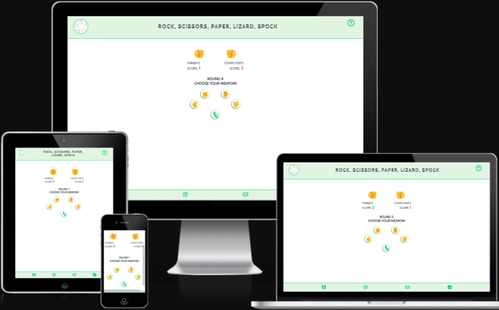

# Rock, Scissors, Paper, Lizard, Spock -  Testing

Visit the deployed site: [Rock, Scissors, Paper, Lizard, Spock](https://fariba-kamani.github.io/rockScissorsPaperLizardSpock/)

- - -

## CONTENTS

* [AUTOMATED TESTING](#automated-testing)
  * [W3C Validator](#w3c-validator)
  * [JavaScript Validator](#javascript-validator)
  * [Lighthouse](#lighthouse)
    * [Desktop Results](#desktop-results)
    * [Mobile Results](#mobile-results)
  * [Accessibility Testing](#accessibility-testing)
  * [Responsive Testing](#responsive-testing)
* [MANUAL TESTING](#manual-testing)
  * [Testing User Stories](#testing-user-stories)
  * [Full Testing](#full-testing)
    * [The Common Features](#the-common-features)
    * [The Login Phase](#the-login-phase)
    * [The Game Phase](#the-game-phase)
    * [The final result phase](#the-final-result-phase)

Testing was ongoing throughout the entire project development. Chrome DevTools was used while building to find and resolve any issues that arose and to ensure that everything was working correctly as expected. The same tools were also employed to verify that the project is responsive, visually appealing, and functions as intended on all standard screen sizes. 
The website has been tested on the following browsers: Chrome, Microsoft Edge, and Safari. Additionally, I tested the project on a VivoBook Asus laptop, iPhone 13, and iPhone 14. Furthermore, a few friends conducted additional testing on both Android and iOS mobile devices. 

### Automated Testing

#### W3C Validator

  - HTML: No errors were returned for index.html and 404.html when passing through the official [W3C validator](https://validator.w3.org/).

  - CSS: No errors were found for style.css when passing through the official [Jigsaw validator](https://jigsaw.w3.org/css-validator/).

#### JavaScript Validator

[JSHint](https://jshint.com/) was used to validate the JavaScript code. No errors were found for script.js when passed through JSHint.

#### Lighthouse

I used Lighthouse within Chrome DevTools to test the performance, accessibility, best practices, and SEO of the website. I have included the test results below.

##### Desktop Results

* Home page

    
  
* 404 error page

    

##### Mobile Results

* Home page

    

* 404 error page

    

#### Accessibility Testing

#### Responsive Testing

### Manual Testing

#### **Testing User Stories**

#### **The Full Testing**

##### The Common Features

| Feature | Expected Outcome | Testing Performed | Result | Pass/Fail |
| --- | --- | --- | --- | --- |
| Favicon for the browser tab | To show on the browser tab | Opened the website | It shows on the browser tab | Pass |
|  |  |  |  | Pass |
|  |  |  |  | Pass |
|  |  |  |  | Pass |
|  |  |  |  | Pass |
|  |  |  |  | Pass |
|  |  |  |  | Pass |
|  |  |  |  | Pass |
| Footer link icons | To open in a seperate tab | Clicked on each icon | They all direct to their related links openning in a new tab | Pass |
| Footer icons hover effect | To turn yellow when hovered over for desktops | Hovered over all the footer icons | They turn yellow when hovered over | Pass |

##### The Login Phase

 | Feature | Expected Outcome | Testing Performed | Result | Pass/Fail |
| --- | --- | --- | --- | --- |
|  |  |  |  | Pass |
|  |  |  |  | Pass |
|  |  |  |  | Pass |
|  |  |  |  | Pass |

##### The Game Phase

 | Feature | Expected Outcome | Testing Performed | Result | Pass/Fail |
| --- | --- | --- | --- | --- |
|  |  |  |  | Pass |
|  |  |  |  | Pass |
|  |  |  |  | Pass |
|  |  |  |  | Pass |
 

##### The Final Result Phase

 | Feature | Expected Outcome | Testing Performed | Result | Pass/Fail |
| --- | --- | --- | --- | --- |
|  |  |  |  | Pass |
|  |  |  |  | Pass |
|  |  |  |  | Pass |
|  |  |  |  | Pass |